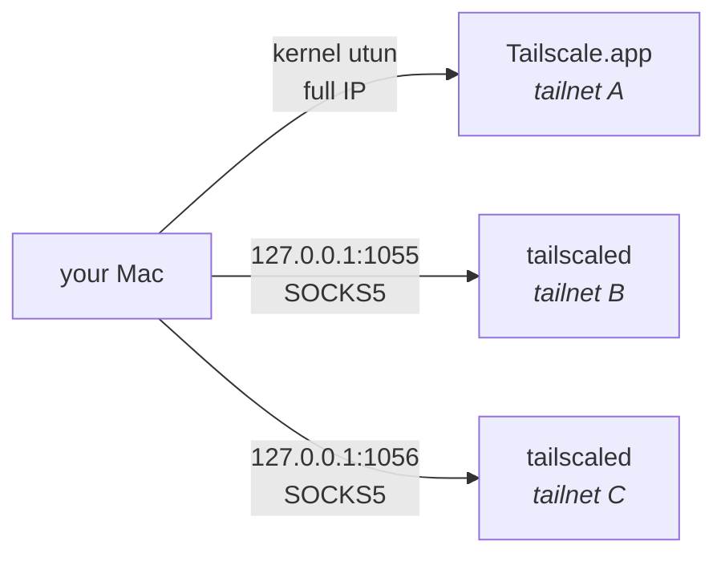

<h1 align="center">foxtail</h1>

<p align="center">
  <b>Be on all your Tailscale tailnets at once.</b><br>
  Work, home, client, lab — no switching, no VM, no root.
</p>

<p align="center">
  
  
  
  
</p>

---

The official Tailscale client connects to **one tailnet at a time**. If you have a
work tailnet, a personal one and a client's, you switch between them all day —
[tailscale#183][issue] has been open since 2020.

`foxtail` lets you have all of them at once. Your GUI Tailscale.app keeps one
tailnet fully native; every *additional* tailnet runs as an isolated userspace
`tailscaled` behind its own local SOCKS5/HTTP proxy.

```console
$ foxtail ls
NAME           PORT   STATE      TAILNET/ACCOUNT              NODES
(GUI app)      native native     lab.example.com              4
work           1056   up         me@work.example              7
personal       1055   up         me@personal.example          6

$ foxtail ssh work build-box
me@build-box:~$

$ foxtail exec personal curl -s http://nas:8080/health
{"status":"ok"}

$ foxtail forward personal mac-mini 5901:5900
127.0.0.1:5901 -> mac-mini:5900 (via personal)
screen sharing:  open vnc://localhost:5901
```

[issue]: https://github.com/tailscale/tailscale/issues/183

## Why it works

Every tailnet allocates addresses out of the same `100.64.0.0/10` block. Two
kernel-mode Tailscale clients would therefore fight over the routing table, and
only one can own the `utun` device and system DNS. That is the real reason the
official client refuses to do this.

Userspace mode sidesteps the fight entirely. An extra daemon started with
`--tun=userspace-networking` creates no network interface, writes no routes and
claims no DNS. It hands you a local proxy instead, so there is nothing left to
collide.



Each extra daemon also gets `--port=0`, so its WireGuard socket lands on an
ephemeral port and never collides with the GUI app's `41641`.

## Install

```sh
brew tap michaelcereda/foxtail https://github.com/MichaelCereda/foxtail
brew install michaelcereda/foxtail/foxtail
```

The formula name has to be fully qualified. Homebrew refuses to resolve a bare
`brew install foxtail` from a third-party tap.

Or from a clone:

```sh
git clone https://github.com/MichaelCereda/foxtail.git ~/Projects/foxtail
ln -s ~/Projects/foxtail/bin/foxtail ~/.local/bin/foxtail
```

Either way, foxtail needs the Tailscale **GUI app** for the native tailnet and
the **`tailscaled` binary** for the extra ones, plus `jq`. Homebrew pulls in the
latter two; install the app separately if you do not have it:

```sh
brew install --cask tailscale-app
```

Then check everything is in place:

```sh
foxtail doctor
```

## Usage

```sh
foxtail                       # interactive menu
foxtail ls                    # every tailnet and its state
foxtail nodes                 # every node on every tailnet, with IPs and link status
foxtail nodes work            # just one tailnet
foxtail up work               # start the daemon and log in
foxtail down work             # stop the daemon, keep the login
foxtail exec work curl http://intranet/
foxtail ssh work build-box
foxtail forward work mac-mini 5901:5900   # loopback port for apps that ignore proxies
foxtail rm work               # stop and delete state (asks first)
foxtail enable work           # start at login, restart on crash (launchd)
foxtail disable work          # stop starting automatically
foxtail doctor                # check this machine's setup and daemon health
foxtail selftest              # assert foxtail's own helpers still work
```

| Command | What it does |
| --- | --- |
| `ls` | Table of the native tailnet plus every managed one: port, state, owning account, node count |
| `nodes [name]` | Every node on every tailnet (or just one): name, Tailscale IP, OS, reachability, and whether the link is direct or relayed |
| `up <name> [port]` | Starts a userspace daemon and logs in. Picks the lowest free port from 1055 if you don't name one |
| `down <name>` | Stops the daemon. The login survives, so `up` reconnects without re-authenticating |
| `exec <name> cmd…` | Runs any command with `ALL_PROXY` / `HTTP_PROXY` / `HTTPS_PROXY` pointed at that tailnet |
| `forward <name> host <local>:<remote>` | Exposes a remote port on `127.0.0.1` for apps that ignore proxy settings. Reconnects if the tunnel drops. Rides SSH, so the node must accept your key |
| `ssh <name> host` | `ssh` through that tailnet's proxy, so MagicDNS names work |
| `rm <name>` | Stops the daemon and deletes its local state |
| `enable <name>` | Installs a launchd agent so the tailnet starts at login and restarts if it crashes |
| `disable <name>` | Removes the launchd agent. The running daemon is left alone |
| `doctor` | Health check for *your machine*: dependencies, daemon and proxy state, login state, port clashes, profile drift. Exits non-zero on a failure |
| `selftest` | Health check for *foxtail itself*: path helpers, name validation, port selection |

### Seeing every node at once

`foxtail nodes` is the view the official client cannot give you — every node on
every tailnet you are connected to, in one table:

```console
$ foxtail nodes
  NODE                                   IP              OS     STATE         LINK

(GUI app) (native) — headscale.example.com
  fileserver.hq.example                  100.64.0.1      linux  online        idle
  laptop.hq.example                      100.64.0.4      macOS  online        -  ← this Mac

work (port 1056) — me@work.example
  build-box.tail0a1b2c.ts.net            100.81.10.48    linux  online        relay nyc
  git.tail0a1b2c.ts.net                  100.125.10.78   linux  online        idle
  old-laptop.tail0a1b2c.ts.net           100.96.10.19    macOS  offline 08-20 -

personal (port 1055) — me@personal.example
  nas.tail3d4e5f.ts.net                  100.98.14.22    macOS  online        direct 192.168.1.50
  phone.tail3d4e5f.ts.net                100.65.10.92    iOS    online        idle
```

Names are printed in full so they can be copied straight into `foxtail ssh` or a
browser. Each group is headed by the tailnet, its proxy port and the account
that owns it.

`LINK` reports only connections that are actually up — `direct` with the peer's
address when the connection is peer-to-peer, `relay <region>` when it is going
through DERP, `idle` when the node is reachable but nothing is flowing. An idle
peer's home DERP region is deliberately *not* shown, because printing it reads
as "this traffic is being relayed" when there is no connection at all.

Node names come from MagicDNS rather than the reported hostname, so iOS devices
show up under their real names instead of `localhost`.

### Pointing other tools at a tailnet

`exec` is a thin wrapper around proxy environment variables, so anything that
respects them works:

```sh
foxtail exec work psql "postgres://db.internal/app"
foxtail exec work git clone git@git.internal:team/repo.git
eval "$(foxtail exec work env | grep PROXY)"    # or set them for a whole shell
```

Note the proxy speaks `socks5h`, not `socks5` — the `h` makes the daemon resolve
MagicDNS names. Plain `socks5` would ask your Mac, which knows nothing about
those tailnets.

### Screen sharing, GUI clients, and other apps that ignore proxies

Screen Sharing, database GUIs, and most native clients ignore proxy settings
entirely, so they cannot reach a proxied tailnet — there is no route to
`100.64.0.0/10` for them to use. Give them a plain loopback port instead:

```console
$ foxtail forward personal mac-mini.tail3d4e5f.ts.net 5901:5900
127.0.0.1:5901 -> mac-mini.tail3d4e5f.ts.net:5900 (via personal)
screen sharing:  open vnc://localhost:5901
Ctrl-C to stop.
```

Then point the app at `127.0.0.1:5901`. This rides SSH, so the target node has
to accept your SSH key — which is usually true of the machines you would want to
screen-share into anyway.

The forward reconnects on its own. A laptop sleeping, or a peer changing network
path, drops the SSH connection silently, and without this the local port stays
open while going nowhere — the app just stops working with no explanation.
Ctrl-C ends it for good.

Run it in the background if you do not want to give it a terminal:

```sh
foxtail forward personal mac-mini.tail3d4e5f.ts.net 5901:5900 &
```

It will not survive a reboot; there is no launchd agent for forwards the way
there is for tailnets.

Note that macOS Screen Sharing also advertises UDP 3283 for Apple Remote
Desktop; that will not work, but plain VNC on 5900 is all Screen Sharing needs.

### Worked example: a shell and a screen on a machine you cannot route to

Say the Mac you want is on your personal tailnet, while your laptop's native
tailnet is something else entirely. Start by finding it — never guess the name,
and copy the full one:

```console
$ foxtail nodes personal
  NODE                                   IP              OS     STATE         LINK

personal (port 1055) — me@personal.example
  mac-mini.tail3d4e5f.ts.net             100.98.14.22    macOS  online        idle
  nas.tail3d4e5f.ts.net                  100.124.10.50   linux  online        idle
  phone.tail3d4e5f.ts.net                100.65.10.92    iOS    online        idle
```

A shell is immediate — `ssh` is proxy-aware once foxtail wraps it, and MagicDNS
names work:

```console
$ foxtail ssh personal mac-mini.tail3d4e5f.ts.net
me@mac-mini ~ %
```

Use that shell to confirm the service is actually listening before you go
hunting for network problems that do not exist:

```console
$ foxtail ssh personal mac-mini.tail3d4e5f.ts.net "netstat -an | grep '\.5900' | grep LISTEN"
tcp4       0      0  *.5900                 *.*                    LISTEN
tcp6       0      0  *.5900                 *.*                    LISTEN
```

Screen Sharing itself cannot use the proxy, so give it a loopback port. Leave
this running in its own terminal:

```console
$ foxtail forward personal mac-mini.tail3d4e5f.ts.net 5901:5900
127.0.0.1:5901 -> mac-mini.tail3d4e5f.ts.net:5900 (via personal)
screen sharing:  open vnc://localhost:5901
Ctrl-C to stop.
```

Then connect. Screen Sharing has no idea a tailnet is involved:

```sh
open vnc://localhost:5901
```

Port 5901 rather than 5900 on the local side, because your own Mac may well be
listening on 5900 itself. `forward` refuses a port that is already in use rather
than shadowing it.

The same three steps work for anything else with a GUI client — a database
browser on `5432`, an admin console on `8080`. Find the node, confirm the
service over `ssh`, forward the port.

### Surviving reboots

`foxtail enable <name>` writes a per-tailnet launchd agent to
`~/Library/LaunchAgents/com.foxtail.<name>.plist` and loads it:

```console
$ foxtail enable work
work enabled — starts at login on port 1056, restarts if it crashes

$ foxtail ls
NAME           PORT   STATE      AUTO  TAILNET/ACCOUNT              NODES
(GUI app)      native native     app   lab.example.com              4
work           1056   up         yes   me@work.example              7
```

launchd supervises the daemon directly, so you get two things: it comes back
after a reboot, and `KeepAlive` restarts it if it ever dies. The Tailscale login
lives in the state directory, so a restart reconnects without re-authenticating.

This is a **LaunchAgent**, so it starts at *login*, not at boot — which is the
right scope, since the state lives in your home directory. On a FileVault
machine there is no meaningful difference.

`up` and `down` understand launchd: on an enabled tailnet `down` stops the job
rather than the process, because `KeepAlive` would otherwise restart it
instantly. `rm` removes the agent along with the state.

### doctor

`doctor` answers "is my setup sane right now", and is the first thing to run
when something is off:

```console
$ foxtail doctor
dependencies
  ok    tailscale (/opt/homebrew/bin/tailscale)
  ok    tailscaled (/opt/homebrew/bin/tailscaled)
  ok    jq (/usr/bin/jq)

native tailnet
  ok    Tailscale.app running, control lab.example.com
  warn  'work' is connected natively AND through foxtail — the GUI app may have
        switched profiles (tailscale switch --list)

managed tailnets
  ok    work: proxy on 127.0.0.1:1056
  ok    work: logged in as me@work.example
  warn  personal: daemon not running (foxtail up personal)

conflicts
  ok    no duplicate proxy ports

healthy (2 warning(s))
```

It is distinct from `selftest`: `doctor` inspects your machine, `selftest`
inspects foxtail's own logic. Colour is dropped when stdout is not a terminal,
so it pipes cleanly into a log or a CI job.

### Logging in reliably

Browser login enrols the node on whichever tailnet your browser session already
happens to be signed into. With several Tailscale accounts this is easy to get
wrong, and you only find out afterwards — the node quietly appears on the wrong
tailnet.

Use an auth key when you want certainty:

```sh
TS_AUTHKEY=tskey-auth-... foxtail up work
```

Generate one under **Settings → Keys** in the admin console of the tailnet you
actually want, and check the tailnet name in the switcher before you click
generate.

The key is never passed as a command-line argument — `foxtail` writes it to a
`0600` temporary file and hands `tailscale` a `file:` reference, so it does not
show up in `ps` for other users on the machine.

## Limits

Worth understanding before you commit to this.

| | Native tailnet (GUI app) | Extra tailnets (foxtail) |
| --- | --- | --- |
| TCP — SSH, HTTP, databases | ✅ | ✅ |
| MagicDNS names | ✅ system-wide | ✅ via the proxy |
| ICMP / `ping` | ✅ | ❌ (`tailscale ping` still works) |
| UDP | ✅ | ❌ |
| Subnet routes, exit nodes | ✅ | ❌ |
| Taildrop, file sharing | ✅ | ❌ |
| Apps that ignore proxy env vars | ✅ | ❌ — use [`forward`](#screen-sharing-gui-clients-and-other-apps-that-ignore-proxies) |
| Inbound connections to your Mac | ✅ | only via `tailscale serve` |

**Keep the tailnet you need full IP access to on the GUI app.** If it serves
subnet routes or you use it as an exit node, it has to be the native one.

Daemons do not survive a reboot unless you run `foxtail enable <name>`; see
[Surviving reboots](#surviving-reboots).

## How state is stored

One directory per tailnet, `~/.tailscale-<name>/`, containing the `tailscaled`
state, its control socket, the chosen proxy port and a daemon log.

There is deliberately **no config file**. `foxtail ls` reads the directories and
the running processes, so its output cannot drift out of sync with what is
actually running. If a daemon was started by hand, `foxtail` still finds it and
recovers its port from the process arguments.

## Troubleshooting

**A node ended up on the wrong tailnet.** Browser session reuse. `foxtail down`,
delete the node in that tailnet's admin console, then re-run with `TS_AUTHKEY`.

**Login hangs and the URL never activates.** Stacked `tailscale up` processes on
one socket deadlock each other. `foxtail up` clears them before logging in; if
you were driving `tailscale` by hand, `pkill -f "socket=.*<name>"` first.

**`foxtail ls` shows an unexpected tailnet on the `(GUI app)` row.** Something
switched the GUI app's profile. `tailscale switch --list`, then
`tailscale switch <id>` to put it back. To stop it happening, log the GUI app
out of the profiles `foxtail` manages so they can't be selected there.

**`ping node.tailXXXX.ts.net` or `host node.tailXXXX.ts.net` says NXDOMAIN.**
Expected. An extra tailnet's names exist only inside its daemon — nothing is
written to your Mac's resolver, deliberately, because that is what lets several
tailnets coexist. Use the name through the proxy instead:

```sh
foxtail ssh personal node.tailXXXX.ts.net
foxtail exec personal curl http://node.tailXXXX.ts.net/
```

Both the short name and the full MagicDNS name work there. `tailscale
--socket=~/.tailscale-<name>/sock ping <shortname>` works too.

This cannot be fixed by adding a resolver entry or an `/etc/hosts` line, and it
is worth understanding why: resolution is not the real limit, **routing** is.
Without a `utun` device there is no route to `100.64.0.0/10`, so a system-wide
name would resolve to an address nothing on your Mac can reach. The proxy has to
be in the path either way.

**A tailnet shows `logged-out` right after starting.** The control socket
appears before the backend has finished starting. Give it a few seconds and run
`foxtail ls` again.

**Connections refused on a node you can `tailscale ping`.** Ping proves the
WireGuard path; refusal is above it. Either nothing is listening on that port,
or the tailnet's ACLs don't grant this new node access to that service.

## Using foxtail from an agent

Automated callers — coding agents, CI jobs, scripts — should read
[AGENTS.md](AGENTS.md). It covers driving foxtail non-interactively, unattended
login with an auth key, machine-readable state, and the failure modes worth
knowing before debugging.

## Contributing

It's one Bash script. Run `foxtail selftest` before you push, and `foxtail
doctor` if you changed anything about daemon or proxy handling.

Tailnet names index into `$HOME/.tailscale-<name>` and are passed to `pgrep`
and `rm -rf`, so they are validated as a trust boundary — letters, digits,
`.`, `_`, `-`, no leading dot, no traversal. `selftest` asserts both the
accepted and rejected cases; please keep it that way.

## License

MIT — see [LICENSE](LICENSE).
