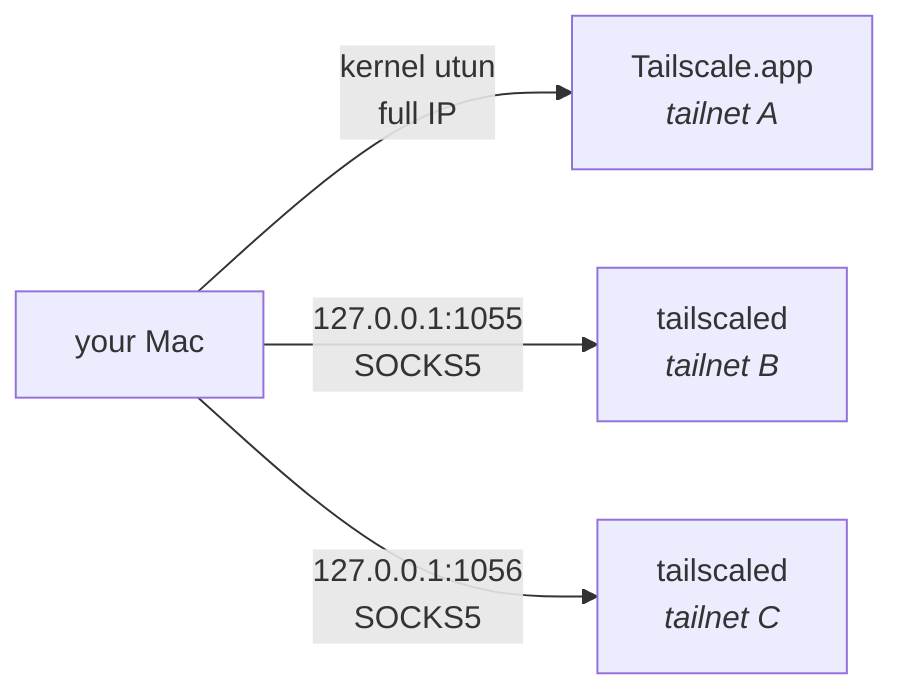

<h1 align="center">foxtail</h1>

<p align="center">
  <b>Be on all your Tailscale tailnets at once.</b><br>
  Work, home, client, lab — no switching, no VM, no root.
</p>

<p align="center">
  
  
  
  
</p>

---

The official Tailscale client connects to **one tailnet at a time**. If you have a
work tailnet, a personal one and a client's, you switch between them all day —
[tailscale#183][issue] has been open since 2020.

`foxtail` lets you have all of them at once. Your GUI Tailscale.app keeps one
tailnet fully native; every *additional* tailnet runs as an isolated userspace
`tailscaled` behind its own local SOCKS5/HTTP proxy.

```console
$ foxtail ls
NAME           PORT   STATE      TAILNET/ACCOUNT              NODES
(GUI app)      native native     lab.example.com              4
work           1056   up         me@work.example              7
personal       1055   up         me@personal.example          6

$ foxtail ssh work build-box
me@build-box:~$

$ foxtail exec personal curl -s http://nas:8080/health
{"status":"ok"}
```

[issue]: https://github.com/tailscale/tailscale/issues/183

## Why it works

Every tailnet allocates addresses out of the same `100.64.0.0/10` block. Two
kernel-mode Tailscale clients would therefore fight over the routing table, and
only one can own the `utun` device and system DNS. That is the real reason the
official client refuses to do this.

Userspace mode sidesteps the fight entirely. An extra daemon started with
`--tun=userspace-networking` creates no network interface, writes no routes and
claims no DNS. It hands you a local proxy instead, so there is nothing left to
collide.



Each extra daemon also gets `--port=0`, so its WireGuard socket lands on an
ephemeral port and never collides with the GUI app's `41641`.

## Install

You need the Tailscale GUI app **and** the CLI daemon binary, plus `jq`:

```sh
brew install tailscale jq          # provides tailscaled; keep Tailscale.app too
```

```sh
git clone git@github.com:MichaelCereda/foxtail.git ~/Projects/foxtail
ln -s ~/Projects/foxtail/bin/foxtail ~/.local/bin/foxtail
foxtail selftest
```

## Usage

```sh
foxtail                       # interactive menu
foxtail ls                    # every tailnet and its state
foxtail up work               # start the daemon and log in
foxtail down work             # stop the daemon, keep the login
foxtail exec work curl http://intranet/
foxtail ssh work build-box
foxtail rm work               # stop and delete state (asks first)
foxtail selftest              # assert internal helpers still work
```

| Command | What it does |
| --- | --- |
| `ls` | Table of the native tailnet plus every managed one: port, state, owning account, node count |
| `up <name> [port]` | Starts a userspace daemon and logs in. Picks the lowest free port from 1055 if you don't name one |
| `down <name>` | Stops the daemon. The login survives, so `up` reconnects without re-authenticating |
| `exec <name> cmd…` | Runs any command with `ALL_PROXY` / `HTTP_PROXY` / `HTTPS_PROXY` pointed at that tailnet |
| `ssh <name> host` | `ssh` through that tailnet's proxy, so MagicDNS names work |
| `rm <name>` | Stops the daemon and deletes its local state |
| `selftest` | Checks path helpers, name round-tripping and port selection |

### Logging in reliably

Browser login enrols the node on whichever tailnet your browser session already
happens to be signed into. With several Tailscale accounts this is easy to get
wrong, and you only find out afterwards — the node quietly appears on the wrong
tailnet.

Use an auth key when you want certainty:

```sh
TS_AUTHKEY=tskey-auth-... foxtail up work
```

Generate one under **Settings → Keys** in the admin console of the tailnet you
actually want, and check the tailnet name in the switcher before you click
generate.

### Pointing other tools at a tailnet

`exec` is a thin wrapper around proxy environment variables, so anything that
respects them works:

```sh
foxtail exec work psql "postgres://db.internal/app"
foxtail exec work git clone git@git.internal:team/repo.git
eval "$(foxtail exec work env | grep PROXY)"    # or set them for a whole shell
```

Note the proxy speaks `socks5h`, not `socks5` — the `h` makes the daemon resolve
MagicDNS names. Plain `socks5` would ask your Mac, which knows nothing about
those tailnets.

## Limits

Worth understanding before you commit to this.

| | Native tailnet (GUI app) | Extra tailnets (foxtail) |
| --- | --- | --- |
| TCP — SSH, HTTP, databases | ✅ | ✅ |
| MagicDNS names | ✅ system-wide | ✅ via the proxy |
| ICMP / `ping` | ✅ | ❌ (`tailscale ping` still works) |
| UDP | ✅ | ❌ |
| Subnet routes, exit nodes | ✅ | ❌ |
| Taildrop, file sharing | ✅ | ❌ |
| Apps that ignore proxy env vars | ✅ | ❌ |
| Inbound connections to your Mac | ✅ | only via `tailscale serve` |

**Keep the tailnet you need full IP access to on the GUI app.** If it serves
subnet routes or you use it as an exit node, it has to be the native one.

Daemons do not survive a reboot — re-run `foxtail up <name>` for each.

## How state is stored

One directory per tailnet, `~/.tailscale-<name>/`, containing the `tailscaled`
state, its control socket, the chosen proxy port and a daemon log.

There is deliberately **no config file**. `foxtail ls` reads the directories and
the running processes, so its output cannot drift out of sync with what is
actually running. If a daemon was started by hand, `foxtail` still finds it and
recovers its port from the process arguments.

## Troubleshooting

**A node ended up on the wrong tailnet.** Browser session reuse. `foxtail down`,
delete the node in that tailnet's admin console, then re-run with `TS_AUTHKEY`.

**Login hangs and the URL never activates.** Stacked `tailscale up` processes on
one socket deadlock each other. `foxtail up` clears them before logging in; if
you were driving `tailscale` by hand, `pkill -f "socket=.*<name>"` first.

**`foxtail ls` shows an unexpected tailnet on the `(GUI app)` row.** Something
switched the GUI app's profile. `tailscale switch --list`, then
`tailscale switch <id>` to put it back. To stop it happening, log the GUI app
out of the profiles `foxtail` manages so they can't be selected there.

**Connections refused on a node you can `tailscale ping`.** Ping proves the
WireGuard path; refusal is above it. Either nothing is listening on that port,
or the tailnet's ACLs don't grant this new node access to that service.

## Contributing

It's one Bash script. Run `foxtail selftest` before you push.

## License

MIT — see [LICENSE](LICENSE).
