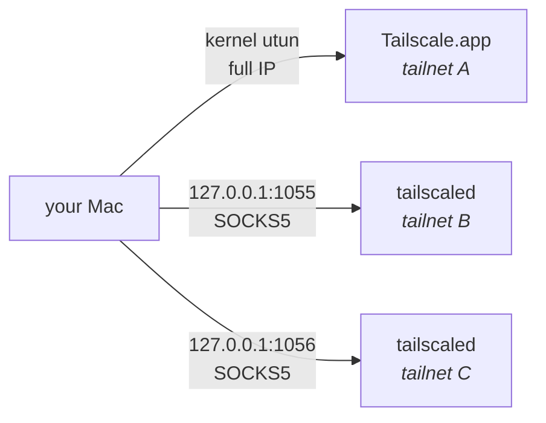

<h1 align="center">foxtail</h1>

<p align="center">
  <b>Be on all your Tailscale tailnets at once.</b><br>
  Work, home, client, lab — no switching, no VM, no root.
</p>

<p align="center">
  
  
  
  
</p>

---

The official Tailscale client connects to **one tailnet at a time**. If you have a
work tailnet, a personal one and a client's, you switch between them all day —
[tailscale#183][issue] has been open since 2020.

`foxtail` lets you have all of them at once. Your GUI Tailscale.app keeps one
tailnet fully native; every *additional* tailnet runs as an isolated userspace
`tailscaled` behind its own local SOCKS5/HTTP proxy.

```console
$ foxtail ls
NAME           PORT   STATE      TAILNET/ACCOUNT              NODES
(native)       -      native     lab.example.com              4
work           1056   up         me@work.example              7
personal       1055   up         me@personal.example          6

$ foxtail work ssh build-box
me@build-box:~$

$ foxtail personal curl -s http://nas:8080/health
{"status":"ok"}

$ foxtail personal open vnc://mac-mini
127.0.0.1:5901 -> mac-mini:5900 (via personal)
Ctrl-C to stop.

$ ssh build-box.work          # plain ssh, once your ssh config knows about foxtail
me@build-box:~$
```

[issue]: https://github.com/tailscale/tailscale/issues/183

## Why it works

Every tailnet allocates addresses out of the same `100.64.0.0/10` block. Two
kernel-mode Tailscale clients would therefore fight over the routing table, and
only one can own the `utun` device and system DNS. That is the real reason the
official client refuses to do this.

Userspace mode sidesteps the fight entirely. An extra daemon started with
`--tun=userspace-networking` creates no network interface, writes no routes and
claims no DNS. It hands you a local proxy instead, so there is nothing left to
collide.


```mermaid
graph LR
  A[your Mac] -->|kernel utun<br/>full IP| B[Tailscale.app<br/><i>tailnet A</i>]
  A -->|127.0.0.1:1055<br/>SOCKS5| C[tailscaled<br/><i>tailnet B</i>]
  A -->|127.0.0.1:1056<br/>SOCKS5| D[tailscaled<br/><i>tailnet C</i>]
```

Each extra daemon also gets `--port=0`, so its WireGuard socket lands on an
ephemeral port and never collides with the GUI app's `41641`.

## Install

```sh
brew install michaelcereda/tap/foxtail
```

That taps [michaelcereda/homebrew-tap](https://github.com/MichaelCereda/homebrew-tap)
and installs in one step; `brew upgrade` picks up new releases from then on.

If you installed v0.1.4 or earlier with `brew tap michaelcereda/foxtail …`,
switch to the new tap once:

```sh
brew uninstall foxtail && brew untap michaelcereda/foxtail
brew install michaelcereda/tap/foxtail
```

Or from a clone:

```sh
git clone https://github.com/MichaelCereda/foxtail.git ~/Projects/foxtail
ln -s ~/Projects/foxtail/bin/foxtail ~/.local/bin/foxtail
```

Either way, foxtail needs the Tailscale **GUI app** for the native tailnet and
the **`tailscaled` binary** for the extra ones, plus `jq` and `socat` (for
local forwards). Homebrew pulls in all three; install the app separately if you
do not have it:

```sh
brew install --cask tailscale-app
```

Then check everything is in place:

```sh
foxtail doctor
```

`doctor` also tells you when plain `ssh host.<tailnet>` is not set up yet, and
prints the lines to add; see [Plain `ssh`, with no prefix](#plain-ssh-with-no-prefix).

## Usage

```sh
foxtail                       # interactive menu
foxtail ls                    # every tailnet and its state
foxtail nodes                 # every node on every tailnet, with IPs and link status
foxtail nodes work            # just one tailnet
foxtail up work               # start the daemon and log in
foxtail down work             # stop the daemon, keep the login
foxtail work                  # a shell whose commands all reach that tailnet
foxtail work ssh build-box    # any command, prefixed with the tailnet name
foxtail work curl http://intranet/
foxtail work open vnc://mac-mini
foxtail exec work curl http://intranet/   # the explicit form of the same thing
foxtail ssh work build-box                # older form, still works
foxtail forward work mac-mini 5901:5900   # loopback port for apps that ignore proxies
foxtail nc build-box.work 22  # raw pipe, what ssh's ProxyCommand calls
foxtail owns build-box.work   # is this host on a foxtail tailnet? (for ssh's Match exec)
foxtail et me@build-box.work  # et, tailnet taken from the name; other hosts go to plain et
foxtail open vnc://mac-mini.work   # Screen Sharing, same rule
eval "$(foxtail init --et --vnc)"  # in ~/.zshrc: plain et / open vnc:// understand foxtail names
foxtail rm work               # stop and delete state (asks first)
foxtail enable work           # start at login, restart on crash (launchd)
foxtail disable work          # stop starting automatically
foxtail doctor                # check this machine's setup and daemon health
foxtail selftest              # assert foxtail's own helpers still work
```

| Command | What it does |
| --- | --- |
| `ls` | Table of the native tailnet plus every managed one: port, state, owning account, node count |
| `nodes [name]` | Every node on every tailnet (or just one): name, Tailscale IP, OS, reachability, and whether the link is direct or relayed |
| `up <name> [port]` | Starts a userspace daemon and logs in. Picks the lowest free port from 1055 if you don't name one. Names that clash with a foxtail command (`ls`, `nc`, …) are refused |
| `down <name>` | Stops the daemon. The login survives, so `up` reconnects without re-authenticating |
| `<name> [cmd…]` | Runs `cmd` on that tailnet — see [Running commands on a tailnet](#running-commands-on-a-tailnet). With no command, opens a shell |
| `exec <name> cmd…` | Runs any command with `ALL_PROXY` / `HTTP_PROXY` / `HTTPS_PROXY` pointed at that tailnet, and `ssh` routed through it |
| `forward <name> host <local>:<remote>` | Exposes a remote port on `127.0.0.1` for apps that ignore proxy settings. Plain TCP through the tailnet — no SSH key or `sshd` needed on the node |
| `ssh <name> host` | Same as `foxtail <name> ssh host` |
| `nc [name] host port` | Pipes stdin/stdout to `host:port` on a tailnet. The tailnet can come from the host name instead: `host.<name>` or `host.tailXXXX.ts.net` |
| `et [opts] host` | `et` with the tailnet taken from the host name. A host on no foxtail tailnet is handed to plain `et` untouched |
| `open vnc://host` | Screen Sharing with the tailnet taken from the host name. Any other URL is handed to plain `open` |
| `init [--et] [--vnc]` | Prints shell functions for `eval` in your rc file. See [Shell integration](#shell-integration) |
| `owns <host>` | Succeeds, printing the tailnet, when `host` belongs to a foxtail tailnet. Meant for ssh's `Match exec` |
| `rm <name>` | Stops the daemon and deletes its local state |
| `enable <name>` | Installs a launchd agent so the tailnet starts at login and restarts if it crashes |
| `disable <name>` | Removes the launchd agent. The running daemon is left alone |
| `doctor` | Health check for *your machine*: dependencies, daemon and proxy state, login state, port clashes, profile drift. Exits non-zero on a failure |
| `selftest` | Health check for *foxtail itself*: path helpers, name validation, port selection |

### Seeing every node at once

`foxtail nodes` is the view the official client cannot give you — every node on
every tailnet you are connected to, in one table:

```console
$ foxtail nodes
TAILNET      NODE                                   IP              OS     STATE         LINK
(native)     fileserver.hq.example                  100.64.0.1      linux  online        idle
(native)     laptop.hq.example                      100.64.0.4      macOS  online        -  ← this Mac
work         build-box.tail0a1b2c.ts.net            100.81.10.48    linux  online        relay nyc
work         git.tail0a1b2c.ts.net                  100.125.10.78   linux  online        idle
work         old-laptop.tail0a1b2c.ts.net           100.96.10.19    macOS  offline 08-20 -
personal     nas.tail3d4e5f.ts.net                  100.98.14.22    macOS  online        direct 192.168.1.50
personal     phone.tail3d4e5f.ts.net                100.65.10.92    iOS    online        idle
```

Every line stands on its own, with the tailnet first, so it greps cleanly:

```console
$ foxtail nodes | grep build-box
work         build-box.tail0a1b2c.ts.net            100.81.10.48    linux  online        relay nyc
```

Names are printed in full so they can be copied straight into `foxtail ssh` or a
browser. `foxtail ls` shows each tailnet's proxy port and owning account.

`foxtail --help` is one line per command for the same reason:
`foxtail --help | grep vnc` shows every entry that mentions it.

`LINK` reports only connections that are actually up — `direct` with the peer's
address when the connection is peer-to-peer, `relay <region>` when it is going
through DERP, `idle` when the node is reachable but nothing is flowing. An idle
peer's home DERP region is deliberately *not* shown, because printing it reads
as "this traffic is being relayed" when there is no connection at all.

Node names come from MagicDNS rather than the reported hostname, so iOS devices
show up under their real names instead of `localhost`.

### Running commands on a tailnet

Put the tailnet name in front of the command:

```sh
foxtail personal ssh michael@bigtaco
foxtail personal scp notes.txt bigtaco:
foxtail personal rsync -a ./site/ bigtaco:/srv/site/
foxtail personal git clone bigtaco:repos/foxtail.git
foxtail personal curl http://bigtaco:8080/
foxtail personal open vnc://bigtaco
foxtail personal et michael@bigtaco
foxtail personal                  # a shell where all of the above work unprefixed
```

Short names (`bigtaco`), full MagicDNS names (`bigtaco.tail3d4e5f.ts.net`)
and foxtail names (`bigtaco.personal`) all work. `bigtaco.local` does not:
`.local` is mDNS, answered by machines on your LAN, never by a tailnet.

Tools do not all fail over a proxy for the same reason, so foxtail handles each
kind differently:

| Kind | Examples | How foxtail gets it through |
| --- | --- | --- |
| Honours proxy variables | `curl`, `kubectl`, `gh`, `psql`, git over https | `ALL_PROXY` / `HTTP_PROXY` / `HTTPS_PROXY` |
| Runs `ssh` from `PATH` | `ssh`, `rsync`, git over ssh | a wrapper put first on `PATH` adds `ProxyCommand` |
| Runs `/usr/bin/ssh` directly | `scp`, `sftp` | `-o ProxyCommand=…` added to the arguments |
| Hands a URL to another app | `open vnc://…` | a loopback forward, and the URL rewritten to point at it |
| Opens its own connection after ssh | `et` | its port forwarded to loopback, ssh pinned to the real host |
| Uses UDP | `mosh`, `ping` | cannot work — the proxy carries TCP only |

`foxtail <name> cmd` is `foxtail exec <name> cmd` plus the special cases in that
table. Use `exec` when you want no special cases.

Note the proxy speaks `socks5h`, not `socks5` — the `h` makes the daemon resolve
MagicDNS names. Plain `socks5` would ask your Mac, which knows nothing about
those tailnets.

**Eternal Terminal** needs `etserver` running on the target, and `et` must be
able to ssh there. The destination has to be the last argument. The login goes
over ssh, as it always does with et; foxtail then forwards the et port (2022,
or `-p`) as plain TCP through the tailnet, so et's own reconnects after sleep or
a network change work as they normally do.

### Plain `ssh`, with no prefix

Add this to the top of `~/.ssh/config`:

```sshconfig
Match exec "foxtail owns %h"
  ProxyCommand foxtail nc %h %p
```

Every tool that reads your ssh config now reaches foxtail tailnets directly —
`ssh`, `scp`, `sftp`, `rsync`, git, VS Code Remote-SSH, Ansible:

```sh
ssh michael@bigtaco.personal
ssh bigtaco.tail3d4e5f.ts.net
scp notes.txt bigtaco.personal:
git clone bigtaco.personal:repos/foxtail.git
code --remote ssh-remote+bigtaco.personal /Users/michael
```

`foxtail owns` only answers for names that end in a foxtail tailnet name
(`.personal`) or in that tailnet's MagicDNS suffix. Every other host — GitHub,
your native tailnet, the LAN — is left alone. It never contacts a daemon, so it
adds no noticeable time to `ssh`. The MagicDNS suffix is cached in the
tailnet's state directory the first time it is needed.

If you prefer to spell out each tailnet, this is equivalent:

```sshconfig
Host *.personal
  ProxyCommand foxtail nc %h %p
```

Put either block **above** any `Host *` section: ssh keeps the first
`ProxyCommand` it sees.

> **Warning:** a tailnet named after a real top-level domain captures that
> domain. Name one `dev`, `app` or `io` and every `*.dev` host you ssh to is
> sent into that tailnet instead of the internet. Pick names that are not TLDs
> — `work`, `personal`, `lab`, `clientname`.

ssh records host keys per name, so `bigtaco`, `bigtaco.personal` and the full
MagicDNS name each ask to be trusted once.

`et` is the one tool the ssh config cannot cover. It logs in over ssh, which
now works, but then opens its own connection to `bigtaco.personal:2022`
through normal DNS. `foxtail et` handles that, and passes any host that is not
on a foxtail tailnet straight to `et`. `foxtail open vnc://bigtaco.personal`
does the same for Screen Sharing.

### Shell integration

To use plain `et` and `open` with foxtail names, add this to `~/.zshrc` or
`~/.bashrc`:

```sh
eval "$(foxtail init --et --vnc)"
```

```sh
et michael@bigtaco.personal        # through the personal tailnet
et michael@server.example.com      # plain et, exactly as before
open vnc://bigtaco.personal        # Screen Sharing through the personal tailnet
open README.md                     # plain open, foxtail is never called
```

Each flag adds one shell function, and nothing is added without one:

| Flag | Adds | Otherwise |
| --- | --- | --- |
| `--et` | `et` goes through `foxtail et` | hosts on no foxtail tailnet reach `et` unchanged |
| `--vnc` | `open` sends `vnc://` URLs to `foxtail open` | every other `open` call skips foxtail entirely |

`foxtail init` prints shell code rather than editing your rc file — the same
approach as `zoxide init` or `direnv hook`. The functions update when foxtail
does, and `foxtail init --et` on its own shows exactly what will be defined.
They override an existing `et` alias.

Note the proxy speaks `socks5h`, not `socks5` — the `h` makes the daemon resolve
MagicDNS names. Plain `socks5` would ask your Mac, which knows nothing about
those tailnets.

### Screen sharing, GUI clients, and other apps that ignore proxies

Screen Sharing, database GUIs, and most native clients ignore proxy settings
entirely, so they cannot reach a proxied tailnet — there is no route to
`100.64.0.0/10` for them to use.

For Screen Sharing, foxtail does the whole thing for you:

```console
$ foxtail personal open vnc://mac-mini
127.0.0.1:5901 -> mac-mini:5900 (via personal)
screen sharing:  open vnc://localhost:5901
Ctrl-C to stop.
```

It picks a free loopback port, forwards it, and opens Screen Sharing on it. A
user in the URL (`vnc://me@mac-mini`) is passed along. The forward lasts until
Ctrl-C.

For any other app, give it a plain loopback port yourself:

```console
$ foxtail forward personal mac-mini.tail3d4e5f.ts.net 5901:5900
127.0.0.1:5901 -> mac-mini.tail3d4e5f.ts.net:5900 (via personal)
screen sharing:  open vnc://localhost:5901
Ctrl-C to stop.
```

Then point the app at `127.0.0.1:5901`. The forward is plain TCP through the
tailnet (`socat` in front of `tailscale nc`), so the node needs no SSH key and
no `sshd` — only the service you are forwarding to.

Each connection the app opens gets its own path through the tailnet, and
nothing is held open in between. A laptop sleeping or a peer changing network
path only breaks the connections open at that moment; the app's next connection
works without the forward being restarted. Ctrl-C ends it.

Run it in the background if you do not want to give it a terminal:

```sh
foxtail forward personal mac-mini.tail3d4e5f.ts.net 5901:5900 &
```

It will not survive a reboot; there is no launchd agent for forwards the way
there is for tailnets.

Note that macOS Screen Sharing also advertises UDP 3283 for Apple Remote
Desktop; that will not work, but plain VNC on 5900 is all Screen Sharing needs.

### Worked example: a shell and a screen on a machine you cannot route to

Say the Mac you want is on your personal tailnet, while your laptop's native
tailnet is something else entirely. Start by finding it — never guess the name,
and copy the full one:

```console
$ foxtail nodes personal
TAILNET      NODE                                   IP              OS     STATE         LINK
personal     mac-mini.tail3d4e5f.ts.net             100.98.14.22    macOS  online        idle
personal     nas.tail3d4e5f.ts.net                  100.124.10.50   linux  online        idle
personal     phone.tail3d4e5f.ts.net                100.65.10.92    iOS    online        idle
```

A shell is immediate — `ssh` is proxy-aware once foxtail wraps it, and MagicDNS
names work:

```console
$ foxtail personal ssh mac-mini
me@mac-mini ~ %
```

Use that shell to confirm the service is actually listening before you go
hunting for network problems that do not exist:

```console
$ foxtail personal ssh mac-mini "netstat -an | grep '\.5900' | grep LISTEN"
tcp4       0      0  *.5900                 *.*                    LISTEN
tcp6       0      0  *.5900                 *.*                    LISTEN
```

Screen Sharing itself cannot use the proxy, so foxtail gives it a loopback
port and opens it. Leave this running in its own terminal:

```console
$ foxtail personal open vnc://mac-mini.tail3d4e5f.ts.net
127.0.0.1:5901 -> mac-mini.tail3d4e5f.ts.net:5900 (via personal)
screen sharing:  open vnc://localhost:5901
Ctrl-C to stop.
```

Screen Sharing has no idea a tailnet is involved. The local side starts at
5901, not 5900, because your own Mac may well be listening on 5900 itself.

The same steps work for anything else with a GUI client — a database browser
on `5432`, an admin console on `8080`. Find the node, confirm the service over
`ssh`, then `foxtail forward personal mac-mini 5433:5432` and point the app at
`127.0.0.1:5433`.

### Surviving reboots

`foxtail enable <name>` writes a per-tailnet launchd agent to
`~/Library/LaunchAgents/com.foxtail.<name>.plist` and loads it:

```console
$ foxtail enable work
work enabled — starts at login on port 1056, restarts if it crashes

$ foxtail ls
NAME           PORT   STATE      AUTO  TAILNET/ACCOUNT              NODES
(native)       -      native     app   lab.example.com              4
work           1056   up         yes   me@work.example              7
```

launchd supervises the daemon directly, so you get two things: it comes back
after a reboot, and `KeepAlive` restarts it if it ever dies. The Tailscale login
lives in the state directory, so a restart reconnects without re-authenticating.

This is a **LaunchAgent**, so it starts at *login*, not at boot — which is the
right scope, since the state lives in your home directory. On a FileVault
machine there is no meaningful difference.

`up` and `down` understand launchd: on an enabled tailnet `down` stops the job
rather than the process, because `KeepAlive` would otherwise restart it
instantly. `rm` removes the agent along with the state.

### doctor

`doctor` answers "is my setup sane right now", and is the first thing to run
when something is off:

```console
$ foxtail doctor
dependencies
  ok    tailscale (/opt/homebrew/bin/tailscale)
  ok    tailscaled (/opt/homebrew/bin/tailscaled)
  ok    jq (/usr/bin/jq)

native tailnet
  ok    Tailscale.app running, control lab.example.com
  warn  'work' is connected natively AND through foxtail — the GUI app may have
        switched profiles (tailscale switch --list)

managed tailnets
  ok    work: proxy on 127.0.0.1:1056
  ok    work: logged in as me@work.example
  warn  personal: daemon not running (foxtail up personal)

conflicts
  ok    no duplicate proxy ports

healthy (2 warning(s))
```

It is distinct from `selftest`: `doctor` inspects your machine, `selftest`
inspects foxtail's own logic. Colour is dropped when stdout is not a terminal,
so it pipes cleanly into a log or a CI job.

### Logging in reliably

Browser login enrols the node on whichever tailnet your browser session already
happens to be signed into. With several Tailscale accounts this is easy to get
wrong, and you only find out afterwards — the node quietly appears on the wrong
tailnet.

Use an auth key when you want certainty:

```sh
TS_AUTHKEY=tskey-auth-... foxtail up work
```

Generate one under **Settings → Keys** in the admin console of the tailnet you
actually want, and check the tailnet name in the switcher before you click
generate.

The key is never passed as a command-line argument — `foxtail` writes it to a
`0600` temporary file and hands `tailscale` a `file:` reference, so it does not
show up in `ps` for other users on the machine.

## Limits

Worth understanding before you commit to this.

| | Native tailnet (GUI app) | Extra tailnets (foxtail) |
| --- | --- | --- |
| TCP — SSH, HTTP, databases | ✅ | ✅ |
| MagicDNS names | ✅ system-wide | ✅ via the proxy |
| ICMP / `ping` | ✅ | ❌ (`tailscale ping` still works) |
| UDP | ✅ | ❌ |
| Subnet routes, exit nodes | ✅ | ❌ |
| Taildrop, file sharing | ✅ | ❌ |
| Apps that ignore proxy env vars | ✅ | ssh-based tools and Screen Sharing handled by [`foxtail <name>`](#running-commands-on-a-tailnet); others need [`forward`](#screen-sharing-gui-clients-and-other-apps-that-ignore-proxies) |
| Inbound connections to your Mac | ✅ | only via `tailscale serve` |

**Keep the tailnet you need full IP access to on the GUI app.** If it serves
subnet routes or you use it as an exit node, it has to be the native one.

Daemons do not survive a reboot unless you run `foxtail enable <name>`; see
[Surviving reboots](#surviving-reboots).

## How state is stored

One directory per tailnet, `~/.tailscale-<name>/`, containing the `tailscaled`
state, its control socket, the chosen proxy port, a daemon log, the cached
MagicDNS suffix, and `bin/ssh` — the wrapper `exec` puts first on `PATH`.

There is deliberately **no config file**. `foxtail ls` reads the directories and
the running processes, so its output cannot drift out of sync with what is
actually running. If a daemon was started by hand, `foxtail` still finds it and
recovers its port from the process arguments.

## Troubleshooting

**A node ended up on the wrong tailnet.** Browser session reuse. `foxtail down`,
delete the node in that tailnet's admin console, then re-run with `TS_AUTHKEY`.

**Login hangs and the URL never activates.** Stacked `tailscale up` processes on
one socket deadlock each other. `foxtail up` clears them before logging in; if
you were driving `tailscale` by hand, `pkill -f "socket=.*<name>"` first.

**`foxtail ls` shows an unexpected tailnet on the `(native)` row.** Something
switched the GUI app's profile. `tailscale switch --list`, then
`tailscale switch <id>` to put it back. To stop it happening, log the GUI app
out of the profiles `foxtail` manages so they can't be selected there.

**`ping node.tailXXXX.ts.net` or `host node.tailXXXX.ts.net` says NXDOMAIN.**
Expected. An extra tailnet's names exist only inside its daemon — nothing is
written to your Mac's resolver, deliberately, because that is what lets several
tailnets coexist. Use the name through the proxy instead:

```sh
foxtail personal ssh node.tailXXXX.ts.net
foxtail personal curl http://node.tailXXXX.ts.net/
ssh node.personal        # with the ssh config block above
```

Both the short name and the full MagicDNS name work there. `tailscale
--socket=~/.tailscale-<name>/sock ping <shortname>` works too.

This cannot be fixed by adding a resolver entry or an `/etc/hosts` line, and it
is worth understanding why: resolution is not the real limit, **routing** is.
Without a `utun` device there is no route to `100.64.0.0/10`, so a system-wide
name would resolve to an address nothing on your Mac can reach. The proxy has to
be in the path either way.

**A tailnet shows `logged-out` right after starting.** The control socket
appears before the backend has finished starting. Give it a few seconds and run
`foxtail ls` again.

**`ssh host.personal` says `Could not resolve hostname`.** Your ssh config
does not have the [`Match exec` block](#plain-ssh-with-no-prefix), or it sits
below a `Host *` section that already set a `ProxyCommand`. `ssh -G
host.personal | grep proxycommand` shows what ssh will actually run.

**`foxtail personal ssh …` fails but `foxtail personal curl …` works.** ssh
reached the host, so read ssh's own message. `Host key verification failed`
means the name is new to `known_hosts` and ssh could not prompt; run it once
from a terminal.

**Connections refused on a node you can `tailscale ping`.** Ping proves the
WireGuard path; refusal is above it. Either nothing is listening on that port,
or the tailnet's ACLs don't grant this new node access to that service.

## Using foxtail from an agent

Automated callers — coding agents, CI jobs, scripts — should read
[AGENTS.md](AGENTS.md). It covers driving foxtail non-interactively, unattended
login with an auth key, machine-readable state, and the failure modes worth
knowing before debugging.

## Contributing

It's one Bash script. Run `foxtail selftest` before you push, and `foxtail
doctor` if you changed anything about daemon or proxy handling.

Tailnet names index into `$HOME/.tailscale-<name>` and are passed to `pgrep`
and `rm -rf`, so they are validated as a trust boundary — letters, digits,
`.`, `_`, `-`, no leading dot, no traversal. Host names given to `nc` end up in
the shell ssh runs `ProxyCommand` with, so they are held to DNS and IP
characters. `selftest` asserts both the accepted and rejected cases; please
keep it that way.

### Releasing

The formula lives in [michaelcereda/homebrew-tap](https://github.com/MichaelCereda/homebrew-tap).
The release tarball is a plain `git archive`:

```sh
git tag -a vX.Y.Z -m "foxtail vX.Y.Z" && git push origin main vX.Y.Z
git archive --format=tar.gz --prefix=foxtail-X.Y.Z/ vX.Y.Z > foxtail-X.Y.Z.tar.gz
gh release create vX.Y.Z foxtail-X.Y.Z.tar.gz --title "foxtail vX.Y.Z"
shasum -a 256 foxtail-X.Y.Z.tar.gz   # then bump url + sha256 in the tap's Formula/foxtail.rb
```

## License

MIT — see [LICENSE](LICENSE).
